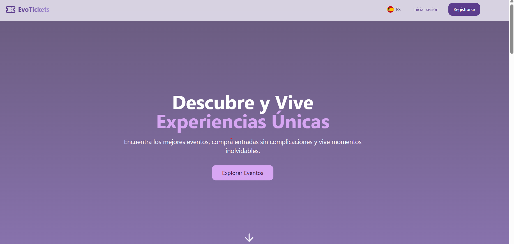
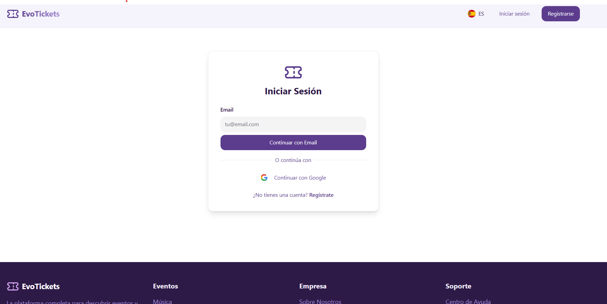
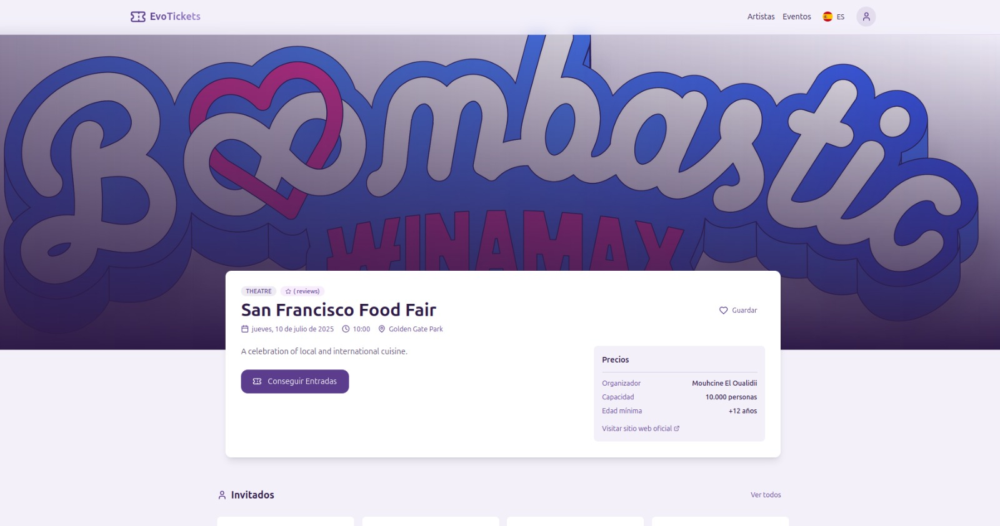
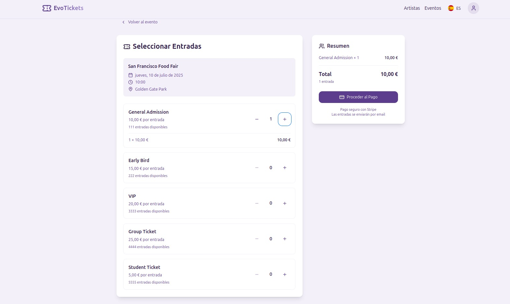

## ⚠️ AVISO IMPORTANTE

> **⚠️ Este repositorio está descontinuado y ya no se encuentra en mantenimiento.**
>
> El desarrollo de EvoTickets continúa en una nueva versión privada con más funcionalidades.
>
> 👉 Puedes acceder a la versión actual en: [https://evotickets.es](https://evotickets.es)


# 🎟️ EvoTickets
**EvoTickets** es una plataforma web para la compra y venta de entradas, así como la gestión integral de eventos. Permite a los usuarios explorar eventos, adquirir tickets de forma sencilla y a los organizadores gestionar la publicación, ventas y asistentes de sus eventos.

---

## 🚀 Despliegue local con Docker

### Requisitos previos

- Tener **Docker** y **Docker Compose** instalados.
- Contar con los archivos de configuración necesarios:
  - `frontend/.env`
  - `backend/src/main/resources/application.properties`

### Pasos

1. Clona el repositorio:

   ```bash
   git clone https://github.com/Whxismou1/EvoTickets.git
   cd EvoTickets
   ```

2. Ejecuta el entorno de desarrollo:

   ```bash
   docker-compose up
   ```

3. Accede a la aplicación:
   - Frontend: `http://localhost:3000`
   - Backend API: `http://localhost:8080`

---

## ⚙️ Tecnologías utilizadas

### Frontend

- React + Vite
- TailwindCSS

### Backend

- Spring Boot

### DevOps

- Docker & Docker Compose
- Git & GitHub

---

## 👥 Roles y funcionalidades

| Rol               | Funcionalidades clave                                                              |
| ----------------- | ---------------------------------------------------------------------------------- |
| **Usuario**       | Registro e inicio de sesión, exploración de eventos, compra y descarga de entradas |
| **Organizador**   | Creación y gestión de eventos, visualización de estadísticas de ventas             |
| **Administrador** | Supervisión de usuarios, gestión de contenido y eventos                            |

---

## 📁 Estructura del proyecto

```
EvoTickets/
├── frontend/                      # Aplicación cliente en React
├── backend/                       # API REST con Spring Boot
├── docker-compose.yml            # Configuración de contenedores
└── README.md
```

---

## 📌 Próximas mejoras

- [ ] Validación de entradas mediante códigos QR
- [ ] Panel de notificaciones para usuarios y organizadores
- [ ] Modo oscuro
- [ ] Incorporación de nuevas funcionalidades y mejoras

---

## 📸 Capturas de pantalla

  
_Vista principal donde los usuarios pueden explorar eventos disponibles._


  
_Interfaz para el inicio de sesión y autenticación de usuarios._


  
_Página con la información detallada de cada evento seleccionado._

  
_Proceso de selección y compra de entradas con resumen del pedido._

## 🧑‍💻 Créditos

Este proyecto ha sido desarrollado por:

- Cristian Álvarez Villán
- Javier Troyano Torrado
- Óscar Díez González
- Mouhcine El Oualidi Charchmi

---
